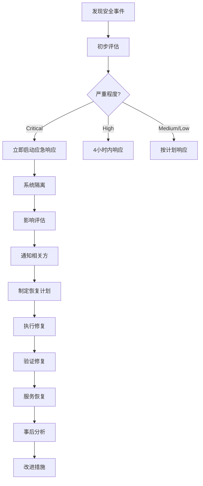

# Shaker智能鸡尾酒推荐系统安全合规文档

## 📋 文档信息
| 项目 | 内容 |
|------|------|
| **产品名称** | Shaker |
| **版本号** | MVP版本1.0.0 |
| **文档版本** | v1.0 |
| **创建日期** | 2024-08-28 |
| **项目负责人** | 郭锐 |
| **文档状态** | ✅ 已完成 | 

---

## 🛡️ 安全策略概述

### 安全目标
> **保护用户数据和系统安全**：确保Shaker系统在提供优质服务的同时，最大程度保护用户隐私和系统安全。

- **数据保护**：保护用户输入数据和系统敏感信息
- **传输安全**：确保数据传输过程中的安全性
- **访问控制**：防止未授权访问和恶意攻击
- **隐私合规**：遵守相关隐私保护法规
- **系统稳定**：保证系统可用性和服务连续性

### 安全原则
- **最小权限**：系统和用户只获得必要的最小权限
- **深度防御**：多层安全措施，避免单点失效
- **安全设计**：从设计阶段就考虑安全因素
- **持续监控**：实时监控和及时响应安全事件
- **透明开放**：安全策略公开透明，接受监督

---

## 🔒 数据安全

### 1. 数据分类和处理

#### 数据分类标准
```typescript
interface DataClassification {
  // 公开数据 - 无安全要求
  public: {
    examples: ["产品介绍", "使用帮助", "开源代码"];
    protection: "无特殊要求";
    retention: "永久保存";
  };
  
  // 内部数据 - 基础保护
  internal: {
    examples: ["系统日志", "性能指标", "错误报告"];
    protection: "访问控制 + 加密存储";
    retention: "30天";
  };
  
  // 敏感数据 - 强化保护
  sensitive: {
    examples: ["API密钥", "用户IP", "系统配置"];
    protection: "强加密 + 访问审计";
    retention: "必要时保留";
  };
  
  // 机密数据 - 最高保护
  confidential: {
    examples: ["用户个人信息", "商业机密"];
    protection: "最高级加密 + 严格访问控制";
    retention: "符合法规要求";
  };
}
```

#### MVP版本数据处理
```typescript
// Shaker MVP版本数据处理策略
interface ShakerDataHandling {
  userInput: {
    classification: "sensitive";
    storage: "临时内存存储，请求完成后立即清除";
    transmission: "HTTPS加密传输";
    logging: "不记录用户具体输入内容";
  };
  
  recommendations: {
    classification: "internal";
    storage: "短期缓存(30分钟)，仅用于性能优化";
    transmission: "HTTPS加密传输";
    logging: "仅记录推荐成功/失败状态";
  };
  
  systemLogs: {
    classification: "internal";
    storage: "加密存储，保留30天";
    content: "不包含用户个人信息";
    access: "仅开发团队访问";
  };
}
```

### 2. 数据加密

#### 传输加密
```typescript
// HTTPS/TLS配置
interface TransportSecurity {
  protocol: "TLS 1.3";
  cipherSuites: [
    "TLS_AES_128_GCM_SHA256",
    "TLS_AES_256_GCM_SHA384",
    "TLS_CHACHA20_POLY1305_SHA256"
  ];
  certificateValidation: "强制验证";
  hstsPolicy: {
    maxAge: "31536000", // 1年
    includeSubDomains: true,
    preload: true
  };
}

// API通信加密
const apiSecurityHeaders = {
  "Strict-Transport-Security": "max-age=31536000; includeSubDomains; preload",
  "Content-Type": "application/json; charset=utf-8",
  "X-Content-Type-Options": "nosniff",
  "X-Frame-Options": "DENY",
  "X-XSS-Protection": "1; mode=block"
};
```

#### 存储加密
```typescript
// 敏感数据存储加密
interface StorageEncryption {
  algorithm: "AES-256-GCM";
  keyManagement: "环境变量 + 密钥轮换";
  implementation: {
    apiKeys: "加密存储在环境变量中";
    temporaryData: "内存加密，自动清理";
    logs: "敏感信息脱敏或加密";
  };
}
```

### 3. 数据最小化

#### 数据收集原则
```typescript
// 数据最小化策略
interface DataMinimization {
  collection: {
    principle: "仅收集业务必需的最少数据";
    userInput: "场景、心情、材料偏好（匿名）";
    noCollection: [
      "用户姓名", "联系方式", "地理位置",
      "设备唯一标识", "浏览历史", "个人资料"
    ];
  };
  
  processing: {
    purpose: "仅用于生成鸡尾酒推荐";
    noProfiling: "不创建用户画像";
    noTracking: "不跨站点跟踪";
    noAnalytics: "不进行用户行为分析";
  };
  
  retention: {
    userInput: "请求处理完成后立即删除";
    recommendations: "缓存30分钟后自动清理";
    logs: "仅保留30天，且不含个人信息";
  };
}
```

---

## 🌐 网络安全

### 1. API安全

#### 认证和授权
```typescript
// API安全配置
interface ApiSecurity {
  // MVP版本：无用户系统，使用API密钥保护
  authentication: {
    type: "API Key";
    storage: "后端环境变量";
    rotation: "定期轮换";
    scope: "仅限推荐服务";
  };
  
  // 访问控制
  accessControl: {
    cors: {
      origin: ["https://shaker.example.com"],
      methods: ["GET", "POST", "OPTIONS"],
      allowedHeaders: ["Content-Type", "Authorization"],
      credentials: false
    };
    
    rateLimit: {
      windowMs: 900000,  // 15分钟
      maxRequests: 100,  // 每IP最多100次请求
      message: "请求过于频繁，请稍后再试";
    };
  };
}
```

#### 输入验证和清洗
```typescript
// 输入验证规则
interface InputValidation {
  userInput: {
    scene: z.enum(["party", "date", "alone", "business", "dining", "night"]),
    moods: z.array(z.string()).min(1).max(3),
    ingredients: z.object({
      spirits: z.array(z.string()).max(10),
      mixers: z.array(z.string()).max(20),
      tools: z.array(z.string()).max(10)
    }),
    preferences: z.object({
      alcohol_level: z.enum(["none", "low", "medium", "high"]),
      sweetness: z.enum(["none", "light", "medium", "high"])
    }),
    special_requirements: z.string().max(500).optional()
  };
  
  sanitization: {
    htmlEscape: "转义所有HTML特殊字符";
    sqlInjection: "使用参数化查询";
    xssProtection: "输出时进行XSS过滤";
    pathTraversal: "验证文件路径";
  };
}
```

### 2. 前端安全

#### 内容安全策略(CSP)
```typescript
// Content Security Policy配置
const cspPolicy = {
  "default-src": ["'self'"],
  "script-src": [
    "'self'",
    "'unsafe-inline'", // Vite开发模式需要
    "https://vercel.live"  // Vercel Analytics
  ],
  "style-src": [
    "'self'",
    "'unsafe-inline'", // Tailwind内联样式
    "https://fonts.googleapis.com"
  ],
  "font-src": [
    "'self'",
    "https://fonts.gstatic.com"
  ],
  "img-src": [
    "'self'",
    "data:",
    "https:"
  ],
  "connect-src": [
    "'self'",
    "https://api.shaker.example.com"
  ],
  "frame-ancestors": ["'none'"],
  "base-uri": ["'self'"],
  "form-action": ["'self'"]
};
```

#### XSS防护
```typescript
// XSS防护措施
interface XssProtection {
  outputEncoding: {
    htmlContent: "HTML实体编码";
    attributes: "属性值编码";
    javascript: "JavaScript编码";
    css: "CSS编码";
  };
  
  domPurify: {
    library: "DOMPurify";
    config: {
      ALLOWED_TAGS: ["b", "i", "em", "strong"],
      ALLOWED_ATTR: ["class"],
      KEEP_CONTENT: false
    };
  };
  
  reactSecurity: {
    jsx: "自动转义危险内容";
    dangerouslySetInnerHTML: "禁止使用";
    userContent: "使用安全的React组件渲染";
  };
}
```

### 3. 后端安全

#### 服务器安全配置
```typescript
// Express安全中间件
import helmet from 'helmet';
import cors from 'cors';
import rateLimit from 'express-rate-limit';

const securityMiddleware = [
  // Helmet安全头
  helmet({
    contentSecurityPolicy: cspPolicy,
    hsts: {
      maxAge: 31536000,
      includeSubDomains: true,
      preload: true
    }
  }),
  
  // CORS配置
  cors({
    origin: process.env.CORS_ORIGIN,
    methods: ['GET', 'POST', 'OPTIONS'],
    allowedHeaders: ['Content-Type', 'Authorization'],
    credentials: false
  }),
  
  // 速率限制
  rateLimit({
    windowMs: 15 * 60 * 1000, // 15分钟
    max: 100, // 限制每个IP最多100次请求
    message: '请求过于频繁，请稍后再试',
    standardHeaders: true,
    legacyHeaders: false
  })
];
```

---

## 🔐 隐私保护

### 1. 隐私设计原则

#### 数据保护设计
```typescript
interface PrivacyByDesign {
  // 1. 事前预防而非事后补救
  proactive: {
    principle: "在设计阶段就考虑隐私保护";
    implementation: "MVP版本不收集个人信息";
    benefit: "从根本上避免隐私风险";
  };
  
  // 2. 隐私作为默认设置
  privacyAsDefault: {
    principle: "系统默认最大程度保护隐私";
    implementation: "用户输入不持久化存储";
    benefit: "用户无需额外操作即享受隐私保护";
  };
  
  // 3. 隐私嵌入设计
  privacyEmbedded: {
    principle: "隐私是系统的核心功能而非附加";
    implementation: "数据最小化是核心设计原则";
    benefit: "隐私保护不妥协功能性";
  };
  
  // 4. 功能齐全 - 正和博弈
  fullFunctionality: {
    principle: "隐私保护和功能性并行不悖";
    implementation: "在保护隐私的前提下提供完整功能";
    benefit: "用户获得完整体验和隐私保护";
  };
  
  // 5. 端到端安全
  endToEndSecurity: {
    principle: "全流程数据安全";
    implementation: "从输入到输出全程加密保护";
    benefit: "消除所有环节的安全风险";
  };
  
  // 6. 公开透明
  visibilityTransparency: {
    principle: "隐私政策和实践公开透明";
    implementation: "详细的隐私政策和安全文档";
    benefit: "用户了解并信任系统";
  };
  
  // 7. 尊重用户隐私
  respectUserPrivacy: {
    principle: "以用户隐私为中心";
    implementation: "用户完全控制自己的数据";
    benefit: "建立用户信任和满意度";
  };
}
```

### 2. 隐私政策

#### 数据处理声明
```markdown
# Shaker隐私政策

## 我们收集什么信息
- **功能数据**：您选择的场景、心情、材料偏好等推荐所需信息
- **技术数据**：访问时间、IP地址（仅用于安全防护）
- **我们不收集**：姓名、邮箱、电话等个人身份信息

## 我们如何使用信息
- **推荐生成**：仅用于为您生成个性化鸡尾酒推荐
- **服务改进**：匿名统计数据用于改进服务质量
- **安全防护**：检测和防范恶意攻击

## 数据保护措施
- **传输加密**：所有数据传输均采用HTTPS加密
- **临时存储**：用户输入数据处理完成后立即删除
- **访问控制**：严格限制数据访问权限

## 您的权利
- **透明权**：了解我们如何处理您的数据
- **删除权**：随时停止使用服务，数据自动清理
- **控制权**：完全控制您分享的信息

## 联系我们
如对隐私政策有疑问，请联系：privacy@shaker.example.com
```

### 3. 合规性检查

#### GDPR合规性（如适用）
```typescript
interface GdprCompliance {
  // 合法性基础
  lawfulBasis: "合法利益 - 提供用户请求的推荐服务";
  
  // 数据主体权利
  dataSubjectRights: {
    information: "提供清晰的隐私政策";
    access: "用户可了解我们处理的数据";
    rectification: "用户可修正错误信息";
    erasure: "数据自动删除，无需用户操作";
    restriction: "用户可随时停止使用服务";
    portability: "不适用，因为我们不存储个人数据";
    objection: "用户可拒绝数据处理";
  };
  
  // 数据保护措施
  dataProtection: {
    encryption: "传输和存储加密";
    minimization: "仅处理必要的最少数据";
    accuracy: "确保数据准确性";
    retention: "最短保留期限";
    security: "适当的技术和组织措施";
  };
}
```

---

## 🔍 安全监控

### 1. 日志和审计

#### 安全日志记录
```typescript
interface SecurityLogging {
  // 记录的事件
  loggedEvents: {
    authentication: "API密钥使用";
    authorization: "访问控制决策";
    dataAccess: "敏感数据访问";
    errors: "安全相关错误";
    attacks: "可疑活动和攻击尝试";
  };
  
  // 日志格式
  logFormat: {
    timestamp: "ISO 8601格式";
    level: "ERROR | WARN | INFO | DEBUG";
    event: "事件类型";
    source: "来源IP（脱敏）";
    result: "成功/失败";
    details: "事件详情（不含敏感信息）";
  };
  
  // 日志保护
  logProtection: {
    encryption: "日志文件加密存储";
    integrity: "日志完整性校验";
    access: "严格的访问控制";
    retention: "30天后自动删除";
  };
}
```

#### 异常检测
```typescript
interface AnomalyDetection {
  // 监控指标
  metrics: {
    requestRate: "异常高频请求";
    errorRate: "错误率突增";
    responseTime: "响应时间异常";
    geoLocation: "异常地理位置访问";
    userAgent: "可疑用户代理";
  };
  
  // 告警阈值
  thresholds: {
    requestsPerMinute: 10; // 每分钟请求数
    errorRatePercent: 5;   // 错误率百分比
    responseTimeMs: 10000; // 响应时间毫秒
  };
  
  // 响应措施
  responses: {
    alert: "立即通知管理员";
    rateLimit: "临时限制访问";
    block: "阻止可疑IP";
    investigate: "记录详细信息供调查";
  };
}
```

### 2. 威胁检测

#### 常见攻击防护
```typescript
interface ThreatProtection {
  // DDoS攻击防护
  ddosProtection: {
    rateLimit: "速率限制";
    cloudflare: "CDN防护";
    monitoring: "流量监控";
    fallback: "服务降级";
  };
  
  // SQL注入防护
  sqlInjection: {
    parameterizedQueries: "参数化查询";
    inputValidation: "输入验证";
    ormProtection: "ORM层防护";
    monitoring: "异常查询监控";
  };
  
  // XSS攻击防护
  xssProtection: {
    outputEncoding: "输出编码";
    csp: "内容安全策略";
    domPurify: "DOM净化";
    validation: "输入验证";
  };
  
  // CSRF攻击防护
  csrfProtection: {
    sameSitecookie: "SameSite Cookie";
    refererCheck: "Referer头检查";
    customHeaders: "自定义头验证";
    tokenValidation: "CSRF令牌验证";
  };
}
```

---

## 🛠️ 安全工具和流程

### 1. 开发安全

#### 安全代码审查
```typescript
interface SecurityCodeReview {
  // 自动化扫描
  automaticScanning: {
    dependencyCheck: "依赖漏洞扫描";
    staticAnalysis: "静态代码分析";
    linting: "安全规则检查";
    secretScanning: "敏感信息扫描";
  };
  
  // 人工审查
  manualReview: {
    codeReview: "代码审查";
    threatModeling: "威胁建模";
    penetrationTest: "渗透测试";
    securityDesignReview: "安全设计审查";
  };
  
  // 审查清单
  reviewChecklist: [
    "输入验证是否完整",
    "输出编码是否正确",
    "认证授权是否安全",
    "敏感数据是否保护",
    "错误处理是否安全",
    "日志记录是否合规"
  ];
}
```

#### 依赖管理
```typescript
interface DependencyManagement {
  // 依赖审计
  dependencyAudit: {
    npm: "npm audit";
    snyk: "Snyk漏洞扫描";
    dependabot: "GitHub Dependabot";
    manual: "定期人工审查";
  };
  
  // 更新策略
  updateStrategy: {
    security: "安全更新立即应用";
    minor: "小版本更新定期检查";
    major: "大版本更新谨慎评估";
    testing: "更新前充分测试";
  };
  
  // 许可证管理
  licenseManagement: {
    scanning: "许可证合规扫描";
    whitelist: "允许的许可证类型";
    review: "新依赖许可证审查";
    documentation: "许可证使用文档";
  };
}
```

### 2. 部署安全

#### 安全部署配置
```typescript
interface SecureDeployment {
  // 环境安全
  environmentSecurity: {
    secrets: "敏感信息加密存储";
    permissions: "最小权限原则";
    isolation: "环境隔离";
    monitoring: "部署监控";
  };
  
  // 容器安全（如适用）
  containerSecurity: {
    baseImage: "安全的基础镜像";
    scanning: "容器镜像扫描";
    runtime: "运行时安全";
    updates: "及时更新";
  };
  
  // 网络安全
  networkSecurity: {
    firewall: "防火墙配置";
    tls: "TLS加密";
    monitoring: "网络监控";
    isolation: "网络隔离";
  };
}
```

---

## 📋 安全检查清单

### 开发阶段检查
- [ ] 安全需求已识别
- [ ] 威胁建模已完成
- [ ] 安全设计已审查
- [ ] 安全编码规范已遵循
- [ ] 依赖漏洞已检查
- [ ] 静态代码分析已通过

### 测试阶段检查
- [ ] 安全测试用例已执行
- [ ] 渗透测试已完成
- [ ] 漏洞扫描已通过
- [ ] 安全配置已验证
- [ ] 日志和监控已测试
- [ ] 应急响应已演练

### 部署阶段检查
- [ ] 生产环境安全配置
- [ ] 敏感信息已保护
- [ ] 访问控制已配置
- [ ] 监控告警已启用
- [ ] 备份恢复已测试
- [ ] 合规性已确认

### 运营阶段检查
- [ ] 定期安全审计
- [ ] 漏洞管理流程
- [ ] 事件响应机制
- [ ] 安全培训计划
- [ ] 合规性监控
- [ ] 持续改进机制

---

## 🚨 应急响应

### 1. 安全事件分类

#### 事件严重程度
```typescript
interface SecurityIncidentSeverity {
  critical: {
    definition: "数据泄露、系统完全不可用";
    responseTime: "1小时内";
    escalation: "立即通知所有相关人员";
    actions: "立即停服、隔离系统、启动危机处理";
  };
  
  high: {
    definition: "部分功能不可用、潜在数据风险";
    responseTime: "4小时内";
    escalation: "通知核心团队";
    actions: "限制影响范围、快速修复";
  };
  
  medium: {
    definition: "性能下降、非核心功能异常";
    responseTime: "24小时内";
    escalation: "通知开发团队";
    actions: "计划修复、监控影响";
  };
  
  low: {
    definition: "轻微异常、无直接影响";
    responseTime: "72小时内";
    escalation: "正常工作流程";
    actions: "常规修复、文档记录";
  };
}
```

### 2. 应急响应流程



---

## 📞 联系信息

### 安全联系方式
- **安全邮箱**: security@shaker.example.com
- **漏洞报告**: security@shaker.example.com
- **应急响应**: emergency@shaker.example.com

### 安全团队
- **安全负责人**: 郭锐
- **技术负责人**: AI开发助手
- **合规负责人**: 待定

---

*文档版本：v1.0*  
*最后更新：2024-08-28*  
*安全策略持续优化中*
