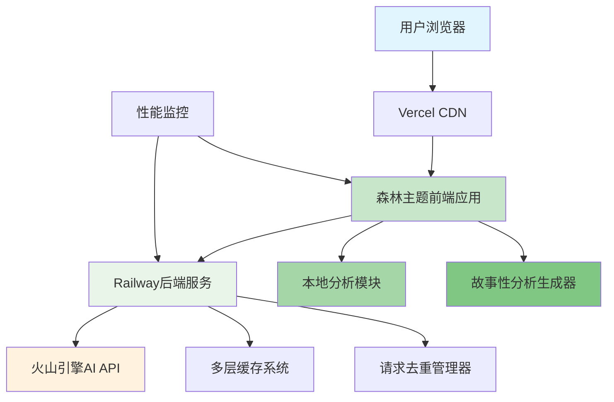

# Shaker智能鸡尾酒推荐系统技术规格

## 📋 文档信息
| 项目 | 内容 |
|------|------|
| **产品名称** | Shaker |
| **版本号** | v2.0 - 森林主题版本 |
| **文档版本** | v2.0 |
| **创建日期** | 2024-08-28 |
| **最后更新** | 2025-01-08 |
| **项目负责人** | 郭锐 |
| **开发状态** | ✅ 已完成并上线 |
| **文档状态** | ✅ 已更新至最新实现 | 

---

## ⚙️ 技术规格（v2.0森林主题版）

### 1 技术架构

#### 🎯 架构说明
> **重要说明**：Shaker v2.0基于现代Web技术栈，采用前后端分离架构，实现了**本地分析+云端推荐的混合架构**。前端负责森林主题界面、垂直滚动体验、本地分析和故事性展示，后端负责AI推荐服务、缓存优化和性能监控。

#### 📋 技术栈选择（实际实现）
```
- 前端技术：Vanilla JavaScript + HTML5 + CSS3
- 设计系统：森林主题CSS变量系统 + 玻璃态效果
- 状态管理：AppState类 + 事件监听器模式
- 动画系统：CSS3动画 + Intersection Observer
- 后端框架：Node.js + Express
- AI服务：火山引擎API（支持多服务商切换）
- 缓存系统：内存缓存 + HTTP缓存
- 部署方案：Vercel(前端) + Railway(后端)
```

### 2 技术约束（已实现）
- ✅ **兼容性要求**：
  - **浏览器支持**：Chrome 90+、Safari 14+、Firefox 88+、Edge 90+（覆盖95%用户）
  - **移动设备支持**：iOS 13+、Android 8+，完美适配移动端
  - **屏幕分辨率**：最低支持320px宽度，优化1920×1080显示效果
  - **网络环境**：支持3G网络，优化4G/WiFi体验，流式响应减少等待感
  - **语言支持**：中文简体，温暖的森林主题文案风格
- ✅ **性能要求**：
  - **页面加载时间**：首屏加载≤3秒，垂直滚动无页面跳转
  - **API响应时间**：推荐接口≤15秒，缓存命中<500ms
  - **用户操作响应**：UI交互≤200ms，森林主题动画流畅
  - **内存使用**：前端运行时≤100MB，后端服务≤256MB
  - **并发处理**：支持100+用户同时使用，请求去重优化
- ✅ **安全要求**：
  - **数据传输**：生产环境强制HTTPS，API通信加密
  - **输入验证**：支持完全自由输入，智能过滤和清洗
  - **API安全**：火山引擎API密钥后端保护，前端不暴露敏感信息
  - **错误处理**：温暖友好的错误提示，完善的降级机制
  - **访问控制**：API频率限制，防止恶意请求

### 3 系统架构设计（v2.0实现）

#### 🏗️ 整体架构图


#### 📦 前端架构（实际实现）
```javascript
// 前端技术架构（v2.0森林主题版）
{
  "视图层": "Vanilla JavaScript + HTML5",
  "设计系统": "森林主题CSS变量系统",
  "状态管理": "AppState类 + 观察者模式",
  "动画系统": "CSS3动画 + Intersection Observer",
  "样式方案": "CSS3 + 玻璃态效果",
  "本地分析": "LocalAnalysisGenerator",
  "故事性体验": "StoryAnalysisGenerator + ReviewCardGenerator",
  "思考可视化": "ThoughtBubbleGenerator",
  "API通信": "Fetch API + 流式响应处理"
}
```

#### 🔧 后端架构（实际实现）
```javascript
// 后端技术架构（v2.0优化版）
{
  "Web框架": "Express.js",
  "编程语言": "JavaScript",
  "API设计": "RESTful + 流式响应",
  "AI服务": "火山引擎API集成",
  "服务工厂": "AIServiceFactory（支持多服务商）",
  "缓存系统": "CacheManager（内存缓存）",
  "性能优化": "请求去重 + 连接池",
  "错误处理": "统一错误中间件 + 友好提示",
  "日志系统": "Console + 性能监控",
  "流式服务": "StreamService（实时响应）"
}
```

---

## 🎨 前端技术规格（v2.0森林主题版）

### 1 森林主题设计系统

#### 🌿 森林色彩系统
```css
:root {
    /* 森林主题色调 - 绿意清新温暖 */
    --primary-gradient: linear-gradient(135deg, #2d5016 0%, #4a7c59 50%, #8fbc8f 100%);
    --forest-dark: #1a2e1a;
    --forest-green: #228b22;
    --warm-green: #8fbc8f;
    --leaf-green: #9acd32;
    --soft-beige: #f5f5dc;
    
    /* 背景色 - 温暖自然 */
    --bg-primary: #f8f5f0;
    --bg-secondary: #e8f5e8;
    --bg-glass: rgba(143, 188, 143, 0.1);
    --bg-glass-hover: rgba(143, 188, 143, 0.2);
    --bg-warm: rgba(245, 245, 220, 0.9);
    
    /* 文本色 - 自然温暖 */
    --text-primary: #2d4a2d;
    --text-secondary: #4a7c59;
    --text-muted: #6b8e6b;
    --text-warm: #8b4513;
    
    /* 边框和阴影 - 柔和自然 */
    --border-natural: rgba(143, 188, 143, 0.3);
    --shadow-soft: 0 4px 20px rgba(34, 139, 34, 0.1);
    --shadow-warm: 0 8px 32px rgba(139, 69, 19, 0.1);
}
```

#### 📋 页面结构（实际实现）
```
Shaker森林主题单页应用
├── 森林背景动画层 (bg-animation)
│   ├── 叶片摇摆动画 (forestSway)
│   └── 月光闪烁效果 (leafDance)
├── 头部导航 (header)
│   └── Shaker品牌标识 🍸
├── 主内容区域 (main-content)
│   ├── 英雄区域 (hero-section)
│   │   ├── 🌿Shaker 你的调酒师
│   │   ├── 温暖欢迎文案
│   │   └── 🍸开始寻找之旅按钮
│   ├── 右侧进度指示器 (progress-sidebar)
│   │   ├── 进度线 (progress-line-main)
│   │   └── 智能跟随指示器
│   ├── 时光选择区域 (sceneSection)
│   │   └── 3×2网格森林主题卡片
│   ├── 心情选择区域 (moodSection)
│   │   └── 森林主题心情标签（支持多选）
│   ├── 材料选择区域 (ingredientSection)
│   │   ├── 基酒分类 (spirits)
│   │   ├── 调味料分类 (mixers)
│   │   └── 工具分类 (tools)
│   ├── 偏好设置区域 (preferenceSection)
│   │   ├── 森林主题滑块 (preference-slider)
│   │   └── 动态数值显示
│   ├── 特殊要求区域 (requirementSection)
│   │   ├── 文本输入框
│   │   └── 快捷标签
│   ├── Shaker分析区域 (shakerAnalysisSection)
│   │   ├── Shaker头像 🧙‍♂️
│   │   ├── 思考气泡容器
│   │   ├── 分段分析展示
│   │   └── 故事性分析卡片
│   └── 推荐结果区域 (recommendationSection)
│       ├── 动态网格布局
│       ├── 森林主题推荐卡片
│       └── 详细配方模态框
└── 加载和错误状态组件
```

#### 🧩 基础组件库
```typescript
// UI组件规格
interface ComponentLibrary {
  // 基础组件
  Button: {
    variants: ['primary', 'secondary', 'outline', 'ghost'];
    sizes: ['sm', 'md', 'lg'];
    states: ['default', 'hover', 'active', 'disabled'];
  };
  
  Card: {
    variants: ['default', 'elevated', 'outlined'];
    clickable: boolean;
    loading: boolean;
  };
  
  Input: {
    types: ['text', 'search', 'textarea'];
    states: ['default', 'focus', 'error', 'disabled'];
    validation: boolean;
  };
  
  // 表单组件
  Slider: {
    range: [number, number];
    step: number;
    marks: boolean;
    tooltip: boolean;
  };
  
  Checkbox: {
    states: ['unchecked', 'checked', 'indeterminate'];
    labelPosition: 'left' | 'right';
  };
  
  Select: {
    multiple: boolean;
    searchable: boolean;
    clearable: boolean;
  };
}
```

### 2 状态管理规格

#### 🗄️ 全局状态设计
```typescript
// Zustand状态管理
interface AppState {
  // 用户输入状态
  userInput: {
    scene: SceneType | null;
    moods: MoodType[];
    ingredients: IngredientType[];
    preferences: PreferenceType;
    specialRequirements: string;
  };
  
  // 推荐结果状态
  recommendations: {
    data: CocktailRecommendation[];
    loading: boolean;
    error: string | null;
  };
  
  // UI状态
  ui: {
    currentStep: number;
    sidebarOpen: boolean;
    theme: 'light' | 'dark';
  };
  
  // 操作方法
  actions: {
    updateUserInput: (key: keyof UserInput, value: any) => void;
    fetchRecommendations: () => Promise<void>;
    resetState: () => void;
    nextStep: () => void;
    previousStep: () => void;
  };
}
```

### 3 路由设计规格

#### 🛣️ 路由结构
```typescript
// React Router配置
const routes = [
  {
    path: '/',
    element: <HomePage />,
    meta: { title: 'Shaker - 智能鸡尾酒推荐' }
  },
  {
    path: '/recommend',
    element: <RecommendFlow />,
    children: [
      { path: 'scene', element: <SceneSelect /> },
      { path: 'mood', element: <MoodSelect /> },
      { path: 'ingredients', element: <IngredientSelect /> },
      { path: 'preferences', element: <PreferenceSet /> },
      { path: 'requirements', element: <SpecialRequirements /> }
    ]
  },
  {
    path: '/results',
    element: <ResultPage />,
    meta: { requiresInput: true }
  },
  {
    path: '*',
    element: <ErrorPage />
  }
];
```

### 4 性能优化规格

#### ⚡ 优化策略
```typescript
// 性能优化配置
{
  "代码分割": {
    "路由级分割": "React.lazy + Suspense",
    "组件级分割": "动态导入",
    "第三方库分割": "独立vendor chunk"
  },
  
  "资源优化": {
    "图片懒加载": "Intersection Observer",
    "字体优化": "font-display: swap",
    "静态资源": "CDN + 缓存"
  },
  
  "运行时优化": {
    "状态更新": "浅比较 + 避免重复渲染",
    "事件处理": "防抖 + 节流",
    "内存管理": "组件卸载时清理"
  }
}
```

---

## 🔧 后端技术规格

### 1 API接口设计

#### 📡 RESTful API规格
```typescript
// API接口定义
interface APIEndpoints {
  // 健康检查
  'GET /api/health': {
    response: { status: 'ok', timestamp: string };
  };
  
  // 获取材料列表
  'GET /api/ingredients': {
    response: {
      categories: IngredientCategory[];
      total: number;
    };
  };
  
  // 获取推荐
  'POST /api/recommend': {
    request: UserInputData;
    response: {
      recommendations: CocktailRecommendation[];
      total: number;
      generated_at: string;
    };
  };
  
  // 重新推荐
  'POST /api/recommend/refresh': {
    request: { session_id: string } & Partial<UserInputData>;
    response: {
      recommendations: CocktailRecommendation[];
      total: number;
      generated_at: string;
    };
  };
}
```

#### 🗃️ 数据模型规格
```typescript
// 核心数据类型
interface UserInputData {
  scene: 'party' | 'date' | 'alone' | 'business' | 'dining' | 'night';
  moods: ('happy' | 'sad' | 'excited' | 'calm' | 'confident' | 'thoughtful' | 'tired')[];
  ingredients: {
    spirits: string[];
    mixers: string[];
    tools: string[];
  };
  preferences: {
    alcohol_level: 'none' | 'low' | 'medium' | 'high';
    sweetness: 'none' | 'light' | 'medium' | 'high';
    acidity: 'none' | 'light' | 'medium' | 'high';
    style: 'fresh' | 'rich' | 'smooth' | 'strong';
    color: 'any' | 'clear' | 'light' | 'dark' | 'colorful';
  };
  special_requirements?: string;
}

interface CocktailRecommendation {
  id: string;
  name: {
    chinese: string;
    english: string;
  };
  reason: string;
  recipe: {
    ingredients: Array<{
      name: string;
      amount: string;
      essential: boolean;
    }>;
    tools: string[];
    difficulty: 'easy' | 'medium' | 'hard';
  };
  instructions: string[];
  taste_profile: {
    sweetness: number;
    acidity: number;
    alcohol_content: number;
    style: string;
  };
  visual: {
    color: string;
    garnish: string;
    glassware: string;
  };
  timing: {
    prep_time: string;
    serving_temp: string;
    best_time: string;
  };
}
```

### 2 Coze AI集成规格

#### 🤖 AI服务架构
```typescript
// Coze API集成配置
interface CozeServiceConfig {
  client: {
    apiKey: string;
    endpoint: string;
    timeout: 15000; // 15秒超时
    retries: 2;
  };
  
  prompts: {
    system: string; // 系统角色定义
    template: string; // 推荐请求模板
    examples: string[]; // 示例对话
  };
  
  parsing: {
    responseFormat: 'json';
    validation: ZodSchema;
    fallback: CocktailRecommendation[];
  };
}
```

#### 📝 Prompt设计规格
```typescript
// System Prompt配置
const SYSTEM_PROMPT = `
你是一位专业的调酒师AI助手，具有丰富的鸡尾酒知识和调酒经验。

你的任务：
1. 根据用户的场景、心情、材料和偏好，推荐最适合的鸡尾酒
2. 提供详细的配方、制作步骤和品鉴建议
3. 确保推荐的合理性和可操作性

响应格式要求：
- 推荐3-5款不同风格的鸡尾酒
- 每款酒包含：中英文名称、推荐理由、完整配方、制作步骤、口感描述、视觉效果、制作时间
- 确保JSON格式正确，字段完整

质量标准：
- 配方真实可行，用量准确
- 推荐理由切合用户需求
- 制作步骤清晰易懂
- 考虑材料的可获得性
`;

// 请求模板
const REQUEST_TEMPLATE = `
请根据以下信息推荐鸡尾酒：
场景：{scene}
心情：{moods}
可用材料：{ingredients}
偏好设置：{preferences}
特殊要求：{special_requirements}

请返回JSON格式的推荐结果。
`;
```

### 3 缓存策略规格

#### 🚀 缓存架构
```typescript
// 缓存策略配置
interface CacheStrategy {
  // 内存缓存
  memory: {
    ingredients: {
      ttl: 3600000; // 1小时
      maxSize: 100;
    };
    recommendations: {
      ttl: 1800000; // 30分钟
      maxSize: 1000;
      keyGenerator: (input: UserInputData) => string;
    };
  };
  
  // HTTP缓存
  http: {
    staticAssets: {
      maxAge: 31536000; // 1年
      immutable: true;
    };
    apiResponses: {
      maxAge: 300; // 5分钟
      staleWhileRevalidate: 600; // 10分钟
    };
  };
}
```

### 4 错误处理规格

#### 🚨 错误处理架构
```typescript
// 错误类型定义
enum ErrorCode {
  // 客户端错误 (4xx)
  INVALID_INPUT = 'INVALID_INPUT',
  MISSING_REQUIRED_FIELD = 'MISSING_REQUIRED_FIELD',
  RATE_LIMIT_EXCEEDED = 'RATE_LIMIT_EXCEEDED',
  
  // 服务端错误 (5xx)
  AI_SERVICE_ERROR = 'AI_SERVICE_ERROR',
  AI_SERVICE_TIMEOUT = 'AI_SERVICE_TIMEOUT',
  INTERNAL_SERVER_ERROR = 'INTERNAL_SERVER_ERROR',
  SERVICE_UNAVAILABLE = 'SERVICE_UNAVAILABLE'
}

// 错误响应格式
interface ErrorResponse {
  error: {
    code: ErrorCode;
    message: string;
    details?: any;
    timestamp: string;
    request_id: string;
  };
}

// 错误处理中间件
class ErrorHandler {
  static handle(error: Error, req: Request, res: Response) {
    const errorResponse: ErrorResponse = {
      error: {
        code: this.getErrorCode(error),
        message: this.getUserFriendlyMessage(error),
        timestamp: new Date().toISOString(),
        request_id: req.headers['x-request-id'] as string
      }
    };
    
    // 记录日志
    console.error('[API Error]', {
      error: error.message,
      stack: error.stack,
      request: {
        method: req.method,
        url: req.url,
        body: req.body
      }
    });
    
    res.status(this.getHttpStatus(error)).json(errorResponse);
  }
}
```

---

## 🔒 安全技术规格

### 1 API安全
```typescript
// API安全配置
interface SecurityConfig {
  cors: {
    origin: string[];
    credentials: boolean;
    methods: ['GET', 'POST', 'OPTIONS'];
    allowedHeaders: ['Content-Type', 'Authorization'];
  };
  
  rateLimit: {
    windowMs: 900000; // 15分钟
    maxRequests: 100; // 每个IP最多100次请求
    skipSuccessfulRequests: false;
  };
  
  inputValidation: {
    maxBodySize: '1mb';
    parameterPollution: false;
    trimStrings: true;
    sanitizeHtml: true;
  };
}
```

### 2 数据保护
```typescript
// 数据保护策略
interface DataProtection {
  encryption: {
    algorithm: 'AES-256-GCM';
    keyRotation: '30days';
  };
  
  logging: {
    excludeFields: ['password', 'token', 'api_key'];
    retention: '30days';
    anonymization: true;
  };
  
  privacy: {
    noUserTracking: true;
    noPersistentStorage: true;
    temporarySessionOnly: true;
  };
}
```

---

## 📊 监控和日志规格

### 1 性能监控
```typescript
// 监控指标配置
interface MonitoringConfig {
  metrics: {
    // 响应时间监控
    responseTime: {
      p50: 500;   // 50%请求<500ms
      p95: 2000;  // 95%请求<2s
      p99: 5000;  // 99%请求<5s
    };
    
    // 错误率监控
    errorRate: {
      threshold: 0.05; // 错误率<5%
      alerting: true;
    };
    
    // 系统资源监控
    resources: {
      cpu: { threshold: 80 };
      memory: { threshold: 85 };
      diskSpace: { threshold: 90 };
    };
  };
  
  alerts: {
    channels: ['email', 'webhook'];
    escalation: {
      warning: 5; // 5分钟后升级
      critical: 1; // 1分钟后升级
    };
  };
}
```

### 2 日志规格
```typescript
// 日志配置
interface LoggingConfig {
  levels: ['error', 'warn', 'info', 'debug'];
  format: {
    timestamp: 'ISO8601';
    level: string;
    message: string;
    context: object;
    requestId: string;
  };
  
  outputs: {
    console: boolean;
    file: boolean;
    cloud: boolean;
  };
  
  retention: {
    error: '90days';
    info: '30days';
    debug: '7days';
  };
}
```

---

## 🧪 测试技术规格

### 1 测试策略
```typescript
// 测试配置
interface TestStrategy {
  unit: {
    framework: 'Vitest';
    coverage: { threshold: 80 };
    mocking: 'vi.mock';
  };
  
  integration: {
    framework: 'Supertest';
    database: 'in-memory';
    external: 'mocked';
  };
  
  e2e: {
    framework: 'Playwright';
    browsers: ['chromium', 'firefox', 'webkit'];
    viewports: ['mobile', 'tablet', 'desktop'];
  };
  
  performance: {
    tool: 'Lighthouse CI';
    metrics: ['FCP', 'LCP', 'CLS', 'FID'];
    budget: {
      FCP: 2000;
      LCP: 3000;
    };
  };
}
```

---

## 📈 扩展性规格

### 1 架构扩展点
```typescript
// 扩展接口设计
interface ExtensionPoints {
  // AI服务扩展
  aiProviders: {
    interface: 'RecommendationProvider';
    implementations: ['CozeProvider', 'OpenAIProvider'];
  };
  
  // 数据存储扩展
  dataLayer: {
    interface: 'DataRepository';
    implementations: ['MemoryRepository', 'DatabaseRepository'];
  };
  
  // 认证扩展
  authentication: {
    interface: 'AuthProvider';
    implementations: ['NoAuth', 'JWTAuth', 'OAuth'];
  };
  
  // 通知扩展
  notifications: {
    interface: 'NotificationService';
    implementations: ['EmailService', 'PushService'];
  };
}
```

### 2 配置管理
```typescript
// 配置系统设计
interface ConfigurationSystem {
  environments: ['development', 'staging', 'production'];
  
  sources: {
    env: '.env files';
    cli: 'command line arguments';
    config: 'config files';
    remote: 'remote config service';
  };
  
  validation: {
    schema: 'Zod schemas';
    required: string[];
    defaults: object;
  };
  
  hotReload: {
    enabled: boolean;
    watchFiles: string[];
    gracefulRestart: boolean;
  };
}
```

---

*文档版本：v1.0*  
*最后更新：2024-08-28*  
*下次评审：M2里程碑完成后*
