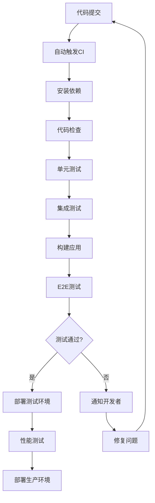

# Shaker智能鸡尾酒推荐系统测试规格

## 📋 文档信息
| 项目 | 内容 |
|------|------|
| **产品名称** | Shaker |
| **版本号** | MVP版本1.0.0 |
| **文档版本** | v1.0 |
| **创建日期** | 2024-08-28 |
| **项目负责人** | 郭锐 |
| **文档状态** | ✅ 已完成 | 

---

## 🎯 测试策略

### 测试目标
> **确保Shaker产品质量**：通过全面的测试覆盖，保证功能正确性、性能达标、用户体验优秀。

- **功能完整性**：所有需求功能正确实现
- **性能达标**：响应时间和并发能力符合要求
- **用户体验**：界面友好，交互流畅
- **兼容性**：多设备、多浏览器支持
- **稳定性**：错误处理完善，系统稳定

### 测试原则
- **测试驱动**：重要功能先写测试
- **自动化优先**：减少手动测试工作量
- **持续集成**：代码提交即触发测试
- **覆盖全面**：功能、性能、安全全覆盖
- **用户视角**：从用户角度验证功能

---

## 🧪 测试类型和框架

### 1. 单元测试 (Unit Testing)

#### 测试框架
```typescript
// 前端单元测试
{
  "framework": "Vitest",
  "renderer": "jsdom",
  "library": "@testing-library/react",
  "coverage": "v8",
  "target": "80% coverage"
}

// 后端单元测试
{
  "framework": "Vitest", 
  "mocking": "vi.mock",
  "coverage": "v8",
  "target": "85% coverage"
}
```

#### 测试范围
- **工具函数**：数据验证、格式化、计算逻辑
- **组件逻辑**：React组件的状态和行为
- **API服务**：业务逻辑和数据处理
- **数据模型**：类型验证和转换

#### 示例测试用例
```typescript
// 前端组件测试
describe('Button Component', () => {
  it('renders with correct text', () => {
    render(<Button>Click me</Button>);
    expect(screen.getByText('Click me')).toBeInTheDocument();
  });

  it('calls onClick when clicked', () => {
    const handleClick = vi.fn();
    render(<Button onClick={handleClick}>Click me</Button>);
    fireEvent.click(screen.getByText('Click me'));
    expect(handleClick).toHaveBeenCalledTimes(1);
  });

  it('shows loading state', () => {
    render(<Button loading>Click me</Button>);
    expect(screen.getByRole('button')).toBeDisabled();
    expect(screen.getByTestId('loading-spinner')).toBeInTheDocument();
  });
});

// 后端服务测试
describe('RecommendService', () => {
  it('generates recommendations successfully', async () => {
    const mockInput = {
      scene: 'party',
      moods: ['happy'],
      ingredients: { spirits: ['vodka'] },
      preferences: { alcohol_level: 'medium' }
    };

    const result = await recommendService.getRecommendations(mockInput);
    
    expect(result).toHaveLength.greaterThan(0);
    expect(result[0]).toHaveProperty('name');
    expect(result[0]).toHaveProperty('recipe');
  });
});
```

### 2. 集成测试 (Integration Testing)

#### 测试范围
- **API集成**：前后端数据流测试
- **外部服务**：Coze API调用测试
- **组件集成**：多组件协作测试
- **路由测试**：页面跳转和数据传递

#### 示例测试用例
```typescript
// API集成测试
describe('Recommendation API Integration', () => {
  it('should return recommendations for valid input', async () => {
    const testInput = {
      scene: 'party',
      moods: ['happy', 'excited'],
      ingredients: {
        spirits: ['vodka', 'gin'],
        mixers: ['lime', 'tonic']
      },
      preferences: {
        alcohol_level: 'medium',
        sweetness: 'light'
      }
    };

    const response = await request(app)
      .post('/api/recommend')
      .send(testInput)
      .expect(200);

    expect(response.body.success).toBe(true);
    expect(response.body.data).toHaveLength.greaterThan(0);
    expect(response.body.data[0]).toMatchObject({
      name: expect.objectContaining({
        chinese: expect.any(String),
        english: expect.any(String)
      }),
      recipe: expect.objectContaining({
        ingredients: expect.any(Array),
        instructions: expect.any(Array)
      })
    });
  });
});
```

### 3. 端到端测试 (E2E Testing)

#### 测试框架
```typescript
{
  "framework": "Playwright",
  "browsers": ["chromium", "firefox", "webkit"],
  "viewports": ["mobile", "tablet", "desktop"],
  "headless": true,
  "parallel": true
}
```

#### 测试流程
```typescript
// E2E测试用例
describe('Complete Recommendation Flow', () => {
  test('user can get cocktail recommendations', async ({ page }) => {
    // 1. 访问首页
    await page.goto('/');
    await expect(page.locator('h1')).toContainText('Shaker');

    // 2. 开始推荐流程
    await page.click('text=开始推荐');
    
    // 3. 选择场景
    await page.click('[data-testid="scene-party"]');
    await page.click('text=下一步');

    // 4. 选择心情
    await page.click('[data-testid="mood-happy"]');
    await page.click('[data-testid="mood-excited"]');
    await page.click('text=下一步');

    // 5. 选择材料
    await page.click('[data-testid="ingredient-vodka"]');
    await page.click('[data-testid="ingredient-lime"]');
    await page.click('text=下一步');

    // 6. 设置偏好
    await page.click('[data-testid="alcohol-medium"]');
    await page.click('text=获取推荐');

    // 7. 验证结果
    await expect(page.locator('[data-testid="recommendation-card"]')).toHaveCount.greaterThan(0);
    await expect(page.locator('text=推荐理由')).toBeVisible();
  });
});
```

### 4. 性能测试 (Performance Testing)

#### 测试指标
```typescript
{
  "页面性能": {
    "First Contentful Paint": "< 1.5s",
    "Largest Contentful Paint": "< 2.5s",
    "Cumulative Layout Shift": "< 0.1",
    "First Input Delay": "< 100ms"
  },
  "API性能": {
    "推荐接口响应时间": "< 15s",
    "其他接口响应时间": "< 500ms",
    "并发处理能力": "100+ 用户",
    "错误率": "< 1%"
  }
}
```

#### 性能测试工具
```typescript
// Lighthouse CI配置
{
  "ci": {
    "collect": {
      "numberOfRuns": 3,
      "settings": {
        "preset": "desktop"
      }
    },
    "assert": {
      "assertions": {
        "categories:performance": ["error", {"minScore": 0.9}],
        "categories:accessibility": ["error", {"minScore": 0.9}],
        "categories:best-practices": ["error", {"minScore": 0.9}]
      }
    }
  }
}
```

---

## 📊 测试用例设计

### 1. 功能测试用例

#### F01 - 场景选择功能
| 用例ID | 测试场景 | 测试步骤 | 预期结果 | 优先级 |
|--------|----------|----------|----------|--------|
| TC_F01_001 | 正常选择场景 | 1. 进入场景选择页<br>2. 点击"聚会派对"卡片 | 卡片被选中高亮显示 | P0 |
| TC_F01_002 | 切换场景选择 | 1. 选择"聚会派对"<br>2. 点击"浪漫约会" | 前一选择取消，新选择生效 | P0 |
| TC_F01_003 | 未选择时点击下一步 | 1. 不选择任何场景<br>2. 点击下一步 | 显示错误提示，阻止继续 | P1 |

#### F02 - 心情选择功能
| 用例ID | 测试场景 | 测试步骤 | 预期结果 | 优先级 |
|--------|----------|----------|----------|--------|
| TC_F02_001 | 选择单个心情 | 1. 点击"开心愉悦"标签 | 标签被选中高亮 | P0 |
| TC_F02_002 | 选择多个心情 | 1. 选择"开心愉悦"<br>2. 选择"兴奋激动" | 两个标签都被选中 | P0 |
| TC_F02_003 | 超过最大选择数 | 1. 选择3个心情<br>2. 尝试选择第4个 | 显示提示，阻止选择 | P1 |

#### F03 - AI推荐功能
| 用例ID | 测试场景 | 测试步骤 | 预期结果 | 优先级 |
|--------|----------|----------|----------|--------|
| TC_F03_001 | 正常获取推荐 | 1. 完成所有输入<br>2. 点击获取推荐 | 返回3-5个推荐结果 | P0 |
| TC_F03_002 | API超时处理 | 1. 模拟API超时<br>2. 观察系统反应 | 显示超时提示，提供重试 | P1 |
| TC_F03_003 | 无效输入处理 | 1. 提交无效数据<br>2. 观察系统反应 | 显示验证错误，阻止提交 | P1 |

### 2. 边界测试用例

#### 边界值测试
| 测试项 | 边界值 | 测试用例 | 预期结果 |
|--------|--------|----------|----------|
| 心情选择数量 | 0个 | 不选择心情点击下一步 | 显示错误提示 |
| 心情选择数量 | 1个 | 选择1个心情 | 正常通过 |
| 心情选择数量 | 3个 | 选择3个心情 | 正常通过 |
| 心情选择数量 | 4个 | 尝试选择4个心情 | 阻止选择，显示提示 |
| 特殊要求文本 | 0字符 | 空文本输入 | 接受空值 |
| 特殊要求文本 | 100字符 | 输入100字符文本 | 正常接受 |
| 特殊要求文本 | 500字符 | 输入超长文本 | 截断或提示限制 |

### 3. 异常测试用例

#### 网络异常测试
| 用例ID | 异常场景 | 模拟方式 | 预期处理 |
|--------|----------|----------|----------|
| TC_E01_001 | 网络断开 | 禁用网络连接 | 显示网络错误提示 |
| TC_E01_002 | 服务器500错误 | Mock 500响应 | 显示服务器错误提示 |
| TC_E01_003 | API响应超时 | 延迟响应>15秒 | 显示超时提示，提供重试 |
| TC_E01_004 | 返回格式错误 | Mock无效JSON | 显示数据错误提示 |

---

## 🔧 测试环境配置

### 1. 测试环境搭建

#### 前端测试环境
```typescript
// vitest.config.ts
import { defineConfig } from 'vitest/config';
import react from '@vitejs/plugin-react';

export default defineConfig({
  plugins: [react()],
  test: {
    globals: true,
    environment: 'jsdom',
    setupFiles: ['./src/__tests__/setup.ts'],
    coverage: {
      provider: 'v8',
      reporter: ['text', 'json', 'html'],
      exclude: [
        'node_modules/',
        'src/__tests__/',
        '**/*.d.ts',
        '**/*.config.*',
      ],
    },
  },
});
```

#### 后端测试环境
```typescript
// vitest.config.ts (backend)
import { defineConfig } from 'vitest/config';

export default defineConfig({
  test: {
    globals: true,
    environment: 'node',
    setupFiles: ['./src/__tests__/setup.ts'],
    coverage: {
      provider: 'v8',
      reporter: ['text', 'json', 'html'],
      thresholds: {
        global: {
          branches: 80,
          functions: 80,
          lines: 80,
          statements: 80,
        },
      },
    },
  },
});
```

### 2. Mock配置

#### API Mock
```typescript
// src/__tests__/mocks/cozeApi.ts
export const mockCozeResponse = {
  recommendations: [
    {
      name: {
        chinese: "莫吉托",
        english: "Mojito"
      },
      reason: "清爽的薄荷味适合聚会氛围",
      recipe: {
        ingredients: [
          { name: "白朗姆酒", amount: "60ml" },
          { name: "青柠汁", amount: "30ml" },
          { name: "薄荷叶", amount: "10片" }
        ],
        tools: ["调酒器", "搅拌棒"],
        difficulty: "简单"
      }
    }
  ]
};

// Mock Coze API
vi.mock('@/services/cozeService', () => ({
  getRecommendations: vi.fn().mockResolvedValue(mockCozeResponse)
}));
```

### 3. 测试数据管理

#### 测试数据集
```typescript
// src/__tests__/fixtures/testData.ts
export const validUserInput = {
  scene: 'party' as const,
  moods: ['happy', 'excited'] as const,
  ingredients: {
    spirits: ['vodka', 'gin'],
    mixers: ['lime', 'tonic', 'ice'],
    tools: ['shaker', 'jigger']
  },
  preferences: {
    alcohol_level: 'medium' as const,
    sweetness: 'light' as const,
    acidity: 'medium' as const,
    style: 'fresh' as const,
    color: 'any' as const
  },
  special_requirements: '希望颜值高一些'
};

export const invalidUserInput = {
  scene: 'invalid_scene',
  moods: [],
  ingredients: {
    spirits: [],
    mixers: [],
    tools: []
  }
};
```

---

## 📈 测试覆盖率要求

### 1. 覆盖率目标

#### 前端覆盖率
```typescript
{
  "语句覆盖率": "≥ 80%",
  "分支覆盖率": "≥ 75%", 
  "函数覆盖率": "≥ 85%",
  "行覆盖率": "≥ 80%"
}
```

#### 后端覆盖率
```typescript
{
  "语句覆盖率": "≥ 85%",
  "分支覆盖率": "≥ 80%",
  "函数覆盖率": "≥ 90%", 
  "行覆盖率": "≥ 85%"
}
```

### 2. 重点测试模块

#### 必须100%覆盖的模块
- 数据验证函数
- 错误处理逻辑
- 安全相关代码
- 核心业务逻辑

#### 可适当降低覆盖率的模块
- UI组件样式代码
- 第三方库封装
- 配置文件
- 常量定义

---

## 🔄 测试流程和CI/CD

### 1. 测试执行流程



### 2. GitHub Actions配置

```yaml
# .github/workflows/test.yml
name: Test Pipeline

on:
  push:
    branches: [ main, develop ]
  pull_request:
    branches: [ main ]

jobs:
  test-frontend:
    runs-on: ubuntu-latest
    steps:
      - uses: actions/checkout@v3
      - uses: actions/setup-node@v3
        with:
          node-version: '18'
          cache: 'npm'
      
      - name: Install dependencies
        run: npm ci
        working-directory: ./frontend
      
      - name: Run unit tests
        run: npm run test:coverage
        working-directory: ./frontend
      
      - name: Upload coverage
        uses: codecov/codecov-action@v3
        with:
          directory: ./frontend/coverage

  test-backend:
    runs-on: ubuntu-latest
    steps:
      - uses: actions/checkout@v3
      - uses: actions/setup-node@v3
        with:
          node-version: '18'
          cache: 'npm'
      
      - name: Install dependencies
        run: npm ci
        working-directory: ./backend
      
      - name: Run unit tests
        run: npm run test:coverage
        working-directory: ./backend

  e2e-test:
    runs-on: ubuntu-latest
    needs: [test-frontend, test-backend]
    steps:
      - uses: actions/checkout@v3
      - uses: actions/setup-node@v3
        with:
          node-version: '18'
      
      - name: Install dependencies
        run: |
          cd frontend && npm ci
          cd ../backend && npm ci
      
      - name: Start services
        run: |
          cd backend && npm start &
          cd frontend && npm run build && npm run preview &
          
      - name: Run E2E tests
        run: npx playwright test
```

---

## 📊 测试报告和监控

### 1. 测试报告格式

#### 测试执行报告
```typescript
interface TestReport {
  summary: {
    total: number;
    passed: number;
    failed: number;
    skipped: number;
    duration: string;
  };
  coverage: {
    statements: number;
    branches: number;
    functions: number;
    lines: number;
  };
  failedTests: Array<{
    name: string;
    error: string;
    file: string;
    line: number;
  }>;
  performance: {
    slowestTests: Array<{
      name: string;
      duration: string;
    }>;
  };
}
```

### 2. 质量门禁

#### 必须满足的条件
- [ ] 所有P0测试用例通过
- [ ] 代码覆盖率达到要求
- [ ] 性能测试指标达标
- [ ] 安全测试无高危漏洞
- [ ] E2E测试核心流程通过

#### 警告条件
- [ ] P1测试用例失败 < 5%
- [ ] 覆盖率下降 > 5%
- [ ] 性能指标轻微超标
- [ ] 新增中低危安全问题

---

## 🔍 测试最佳实践

### 1. 测试编写原则

#### FIRST原则
- **Fast**: 测试运行快速
- **Independent**: 测试之间相互独立
- **Repeatable**: 测试结果可重复
- **Self-Validating**: 测试有明确的通过/失败结果
- **Timely**: 测试及时编写，不拖到最后

#### AAA模式
```typescript
describe('UserService', () => {
  it('should create user successfully', () => {
    // Arrange - 准备测试数据
    const userData = { name: 'John', email: 'john@example.com' };
    const mockRepository = createMockRepository();
    
    // Act - 执行被测试的操作
    const result = userService.createUser(userData);
    
    // Assert - 验证结果
    expect(result).toEqual(expectedUser);
    expect(mockRepository.save).toHaveBeenCalledWith(userData);
  });
});
```

### 2. 测试维护

#### 定期清理
- 删除过时的测试用例
- 更新测试数据
- 重构重复的测试代码
- 优化慢速测试

#### 测试文档
- 测试用例要有清晰的描述
- 复杂测试逻辑要有注释
- 维护测试用例清单
- 记录已知问题和限制

---

## ✅ 测试完成标准

### 功能测试完成标准
- [ ] 所有需求功能都有对应测试用例
- [ ] P0级别测试用例100%通过
- [ ] P1级别测试用例通过率≥95%
- [ ] 边界值和异常场景覆盖完整

### 性能测试完成标准
- [ ] 页面加载性能达标
- [ ] API响应时间符合要求
- [ ] 并发压力测试通过
- [ ] 内存使用在合理范围

### 兼容性测试完成标准
- [ ] 主流浏览器测试通过
- [ ] 移动设备适配正常
- [ ] 不同屏幕尺寸显示正确
- [ ] 键盘操作支持完整

---

*文档版本：v1.0*  
*最后更新：2024-08-28*  
*测试规格持续完善中*
